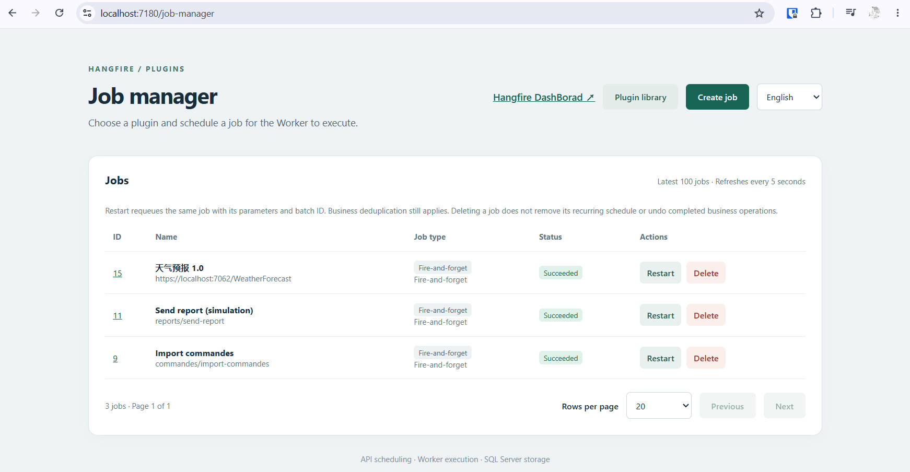
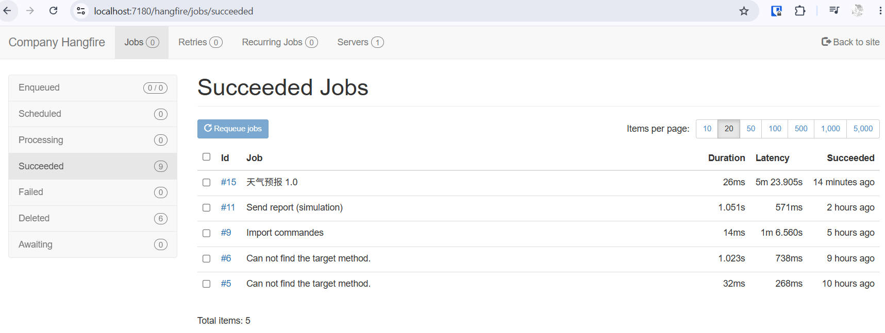
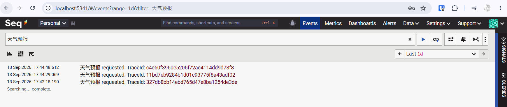

# HangfireDemo

English | [简体中文](README.zh-CN.md)

A .NET 8 and Hangfire task platform for DLL plugins and HTTP GET jobs, backed by SQL Server. Upload a plugin ZIP and schedule work without changing the host source code. The management pages support English (default) and Chinese.

## Contents

- [Screenshots](#screenshots)
- [Architecture](#architecture)
- [Setup and configuration](#setup-and-configuration)
- [Management pages](#management-pages)
- [Plugin development and packaging](#plugin-development-and-packaging)
- [Scheduling API](#scheduling-api)
- [Hot upgrades and plugin deletion](#hot-upgrades-and-plugin-deletion)
- [WebAPI jobs](#webapi-jobs)
- [Logging and Seq](#logging-and-seq)
- [Build and tests](#build-and-tests)
- [Migration from built-in jobs](#migration-from-built-in-jobs)

## Screenshots

### Job manager



### Hangfire Dashboard



### Seq logs



## Architecture

The platform has four main projects. The solution also includes example projects for development and debugging.

| Project | Responsibility |
|---|---|
| `src/HangfireDemo.Api` | Authentication, plugin upload, scheduling APIs, Razor Pages and Hangfire Dashboard |
| `src/HangfireDemo.Worker` | Hangfire Server, plugin discovery and job execution |
| `src/HangfireDemo.Core` | Plugin contracts, generic runners, loading, scheduling, storage, logging and health checks |
| `tests/HangfireDemo.Tests` | Platform boundaries, plugin loading and SQL Server integration tests |

Core contains no concrete business jobs such as order import or report generation and does not reference business plugin assemblies.

| Example | Purpose |
|---|---|
| `examples/SendReport.Plugin` | Simulated reporting; writes logs without sending email or creating a report file |
| `examples/ReportFormatting` | Private managed dependency used by the report plugin |
| `examples/ImportCommandes.Plugin` | Import entry point, SQL transaction and batch deduplication; actual order import SQL remains a business implementation placeholder |
| `examples/WebApiDemo` | WeatherForecast HTTP endpoint for testing WebAPI jobs |

Api persists requests in Hangfire's SQL storage. Worker runs Hangfire Server, consumes the `default` queue and executes the generic runner. Delayed and recurring work is scheduled through Hangfire; plugins contain business behavior, not scheduling rules.

## Setup and configuration

Use the .NET SDK specified in [global.json](global.json), SQL Server, and PowerShell for packaging. Api and Worker use the same machine and plugin directory. Seq is optional and runs as a native Windows service in this setup.

1. Create a `HangfireDemo` database and run [database/002_create_plugins.sql](database/002_create_plugins.sql). This repeatable script creates `app.PluginVersion`, `app.PluginActive` and `app.PluginWorkerStatus`; it does not migrate existing jobs.
2. Configure the same `ConnectionStrings:HangfireConnection` in Api and Worker. Development enables `Hangfire:PrepareSchemaIfNecessary` to let Hangfire initialize its schema. Production defaults to `false`; provision the Hangfire schema before starting with restricted runtime credentials.
3. Set `Plugins:Directory` to the same absolute path in both hosts. Existing development settings contain machine-specific paths and a SQL instance: change them for your machine. Api needs directory write access; Worker needs read access. Runtime accounts need access to Hangfire storage and the plugin tables.
4. For order import, configure Worker `ConnectionStrings:ApplicationConnection` and run [database/001_create_commande_import_execution.sql](database/001_create_commande_import_execution.sql) in that business database.
5. Outside Development, configure `Security:AdminApiKey`. Configure `Security:ReaderApiKey` for read-only access and adjust `AllowedHosts` for the deployment hostname.

Environment variable equivalents:

| Variable | Purpose |
|---|---|
| `ConnectionStrings__HangfireConnection` | Shared Hangfire/plugin SQL database |
| `ConnectionStrings__ApplicationConnection` | Worker business database used by the import example |
| `Plugins__Directory` | Shared absolute plugin directory |
| `Security__AdminApiKey` | Api administrator credential |
| `Security__ReaderApiKey` | Api reader credential |
| `Logging__File__Directory` | Writable log directory |
| `Logging__Seq__ServerUrl` | Seq ingestion address |
| `Logging__Seq__ApiKey` | Seq ingestion API key, if required |

Run in separate terminals from the repository root:

```powershell
dotnet run --project src/HangfireDemo.Worker
dotnet run --project src/HangfireDemo.Api
```

With the existing HTTPS launch profile, open [Job manager](https://localhost:7180/job-manager), [Plugin library](https://localhost:7180/plugin-library), or [Hangfire Dashboard](https://localhost:7180/hangfire). Use the listening URL printed by the host if your profile differs.

Browser authentication uses HTTP Basic: the password is the API key; the username is not used to select a role. HTTP clients send `X-Hangfire-Api-Key`. Development uses a development administrator identity when both configured keys are empty. The current key handler issues Admin and Reader identities; Admin also satisfies Operator permissions.

Browser writes require the page's antiforgery token in `X-CSRF-TOKEN`. API-key-header clients use their API key instead. Reader can read; Operator/Admin can schedule and manage executions; plugin upload and deletion require Admin.

## Management pages

The job manager initially shows executions. The plugin library is a separate page with search, status filtering, pagination and an **Add plugin** upload dialog. Upload success closes the dialog and refreshes the list. Worker activation is asynchronous: **Pending** means saved but not yet loaded; **Active** means usable; **Failed** shows the loading error. An offline Worker leaves uploads pending until it returns.

Create a job by entering a required **Job name** (up to 200 characters; whitespace-only names are rejected), choosing **Plugin job** or **WebAPI job**, and selecting a schedule:

| Schedule | Behavior |
|---|---|
| Fire-and-forget | Enqueue for execution as soon as a Worker is available |
| Delayed | Execute once after 1–1440 minutes |
| Recurring | Repeat using five-field Cron and a time zone; default `Europe/Paris` |

Plugin jobs require a selected function and a JSON object. WebAPI jobs require a URL and have no JSON parameters. Submitted names appear in both the job list and Dashboard, survive retries/requeues, and are stored with the Hangfire invocation. Existing jobs retain their previous display-name fallback.

The execution list includes the latest 100 plugin/WebAPI executions, refreshes every five seconds and defaults to 20 rows per page (20/50/100 choices). Deleted executions are hidden. Recurring executions appear as individual jobs; manage the recurring definitions in Dashboard or through the APIs. The job manager has no separate recurring-plan list.

- **Restart** requeues the same Hangfire job with its arguments and batch ID. Business deduplication can skip an already processed batch. Running, enqueued and awaiting jobs cannot be restarted.
- **Delete** moves an execution to Hangfire's Deleted state. Cancellation of running jobs is cooperative. It does not undo completed work or delete a recurring definition. Deleted jobs may still be requeued through Dashboard/API before Hangfire expires them.
- A changed state returns HTTP 409; refresh before retrying the operation.

## Plugin development and packaging

Target `net8.0`. The public, concrete entry class must have a parameterless constructor and implement the matching Core contract:

```csharp
public interface IPluginJob
{
    Task ExecuteAsync(JobExecutionContext context,
        JsonElement parameters, CancellationToken cancellationToken);
}
```

`context` provides `JobId`, `BatchId`, `RequestedBy`, `Logger` and `CreateConnection`. Validate business fields in the plugin, throw on failure, and honor cancellation. The host disposes instances implementing `IDisposable` or `IAsyncDisposable`. Do not retain execution context/parameters or start background threads that outlive the job.

`context.CreateConnection("ApplicationConnection")` returns an unopened `DbConnection`; the plugin opens and disposes it. Worker resolves the name from its connection strings. Pass a connection name, not a connection string, in task parameters. Business SQL stays inside the plugin; the host supplies its SQL driver.

The example projects reference the Release `HangfireDemo.Core.dll` with `<Reference>` and `Private=false`, avoiding copies of all host dependencies. `<EnableDynamicLoading>true</EnableDynamicLoading>` generates dependency information. Include private managed dependencies with the plugin and reference the matching host Core version.

ZIP root layout:

```text
plugin.json
SendReport.Plugin.dll
SendReport.Plugin.deps.json
ReportFormatting.dll
```

Example `plugin.json`:

```json
{
  "id": "reports",
  "version": "1.0.0",
  "entryAssembly": "SendReport.Plugin.dll",
  "jobs": [{
    "id": "send-report",
    "name": "Send report (simulation)",
    "type": "SendReport.Plugin.SendReport",
    "parametersExample": {
      "reportName": "Monthly report",
      "recipient": "demo@example.com",
      "simulationSeconds": 1
    }
  }]
}
```

One DLL can provide multiple jobs. Stable function identities are `pluginId/jobId`. IDs contain 1–64 lowercase letters, digits or hyphens and cannot start with a hyphen. Use a semantic version such as `1.0.0`. Keep job IDs and parameter contracts compatible across upgrades. Manifest `name` labels a function; request `name` labels a particular scheduled job.

Run each plugin's own packaging script:

```powershell
powershell -NoProfile -ExecutionPolicy Bypass -File examples/pack-send-report.ps1
powershell -NoProfile -ExecutionPolicy Bypass -File examples/pack-import-commandes.ps1
```

Output defaults to `artifacts/plugins`; both scripts accept `-OutputDirectory`. The report script currently creates versions `1.0.0`, `2.0.0`, `2.0.1` and `2.0.2`. The import script creates `import-commandes-1.0.0.zip`. Each script builds Core before publishing its plugin.

For reports, `reportName` and `recipient` are required. Optional `simulationSeconds` is 0–30 (default 1). `failOnVersion: "1.0.0"` simulates a failure for that version to demonstrate retries after an upgrade. The example only logs; it sends no email.

For `commandes/import-commandes`, use `{"connectionName":"ApplicationConnection"}`. Batch records, transactions and deduplication live in the plugin. The actual order import SQL must still be implemented. No daily import schedule is registered automatically.

## Scheduling API

All creation/update requests below require `name`. Plugin parameters must be a valid JSON object, with serialized text limited to 64K characters. Business-field validation occurs when the plugin runs.

| Endpoint | Permission | Purpose |
|---|---|---|
| `POST /api/plugins` | Admin | Multipart `file` ZIP upload; 202 means pending load |
| `GET /api/plugins` | Reader/Operator/Admin | Versions, Worker status, heartbeat and loading errors |
| `DELETE /api/plugins/{sequence}` | Admin | Soft-delete one plugin version |
| `GET /api/plugin-jobs` | Reader/Operator/Admin | Active functions and JSON examples |
| `POST /api/plugin-jobs/{pluginId}/{jobId}/executions` | Operator/Admin | Immediate or delayed plugin job |
| `GET /api/plugin-executions` | Reader/Operator/Admin | Latest plugin and WebAPI executions |
| `POST /api/plugin-executions/{id}/restart` | Operator/Admin | Requeue an execution |
| `DELETE /api/plugin-executions/{id}` | Operator/Admin | Delete an execution |
| `GET /api/plugin-schedules` | Reader/Operator/Admin | Plugin recurring definitions |
| `GET /api/plugin-schedules/{scheduleId}` | Reader/Operator/Admin | Read one plugin schedule |
| `PUT /api/plugin-schedules/{scheduleId}` | Operator/Admin | Create or replace a plugin schedule |
| `DELETE /api/plugin-schedules/{scheduleId}` | Operator/Admin | Remove future recurrence |
| `POST /api/plugin-schedules/{scheduleId}/trigger` | Operator/Admin | Trigger one occurrence now |
| `POST /api/webapi-jobs/executions` | Operator/Admin | Immediate or delayed HTTP GET job |
| `PUT /api/webapi-schedules/{scheduleId}` | Operator/Admin | Create or replace an HTTP GET schedule |
| `DELETE /api/webapi-schedules/{scheduleId}` | Operator/Admin | Remove an HTTP GET schedule |
| `POST /api/webapi-schedules/{scheduleId}/trigger` | Operator/Admin | Trigger an HTTP GET schedule now |

Immediate plugin request:

```json
{
  "name": "Daily report",
  "mode": "Fire-and-forget",
  "parameters": {"reportName": "Daily report", "recipient": "demo@example.com"}
}
```

For delayed execution, set `"mode":"Delayed"` and `"delayMinutes":1` (1–1440). Plugin execution requests can include an optional GUID `batchId`; this does not make the platform deduplicate business operations automatically.

Plugin recurring request:

```json
{
  "name": "Daily report at 09:00",
  "pluginId": "reports",
  "jobId": "send-report",
  "parameters": {"reportName": "Daily report", "recipient": "demo@example.com"},
  "cron": "0 9 * * *",
  "timeZone": "Europe/Paris"
}
```

Cron uses five fields; omitted time zone defaults to Paris. Hangfire checks recurring schedules by the minute, and queue load can delay the actual start. All platform jobs use `default`. Recurring definitions are stored only in Hangfire, with `plugin:` or `webapi:` prefixes.

Restart/delete execution requests carry the currently observed state, for example `{"expectedState":"Succeeded"}`. Removing a recurring definition does not cancel already queued executions.

Typical responses: 400 invalid request/package; 401 unauthenticated; 403 insufficient permissions; 404 unknown/inactive task or missing schedule; 409 duplicate version or state conflict. An accepted upload can later fail Worker validation; inspect its status and error.

## Hot upgrades and plugin deletion

Api validates and extracts the ZIP into a unique directory under `Plugins:Directory`, then records Pending without executing plugin code. Installed directories use plugin/version identifiers plus a unique suffix; the uploaded ZIP itself is not retained. Worker checks every five seconds, loads each version in its own `AssemblyLoadContext` using `AssemblyDependencyResolver`, and shares the host Core contract assembly.

After successful dependency/interface validation, activation changes through a SQL transaction. A failed load keeps the old active version. The latest version is determined by successful activation and upload sequence, not by comparing semantic version numbers.

`PluginJobRunner` stores stable IDs, JSON and request context rather than plugin CLR types:

- Each execution or retry resolves the current active version at its start and keeps that instance for the attempt.
- Running jobs continue with the old instance. Queued, delayed, retried and future recurring jobs use the newly active version.
- An incompatible parameter contract or removed function fails explicitly; there is no silent fallback.
- Automatic retries are limited to three, with 30/60/120-second delays.
- Every recurring occurrence derives a new batch ID from its Hangfire job ID; retries of that occurrence retain it. Plugins implement business idempotency.
- Worker restores active versions from SQL after restart. Loaded assemblies/old versions are not forcibly unloaded or automatically removed.

Plugin deletion uses the version record's `sequence`, not the plugin ID. It marks the version Deleted and hides it from the library. Deleting the active version removes the activation pointer without reverting to an older version. Running instances continue; future attempts fail if no active version exists. Existing recurring definitions remain until separately removed. Upload a new version to restore the function.

DLL directories and deleted version records remain. A deleted version cannot be uploaded again with the same version number, and Worker will not reactivate it. If a database write fails during upload, an unregistered directory can remain but will not be executed. Before manual cleanup, check stored directory references; do not delete referenced directories.

Defaults: 50 MB compressed, 200 MB expanded, at most 2000 archive entries. Packages reject path traversal, links, native DLLs and duplicate versions. The plugin directory must not contain filesystem links. `Plugins:MaxUploadBytes` and `Plugins:MaxExtractedBytes` can lower limits.

Only trusted .NET 8 managed plugins are supported. They execute with Worker permissions; dependency isolation is not a sandbox. Multi-machine distribution, arbitrary DLL method invocation, native dependencies and untrusted third-party execution are not supported.

## WebAPI jobs

Supply a job name and an absolute HTTP/HTTPS URL. Worker sends GET without a request body, JSON parameters or custom headers; it does not store the response body.

```json
{
  "name": "Weather check",
  "url": "https://localhost:7062/WeatherForecast",
  "mode": "Fire-and-forget"
}
```

For recurring HTTP jobs, PUT a body containing `name`, `url`, `cron` and `timeZone` to `/api/webapi-schedules/{scheduleId}`. Delayed jobs use `mode: "Delayed"` with `delayMinutes`.

Requests time out after 30 seconds and follow at most five redirects, including HTTP-to-HTTPS redirects. Only 2xx responses succeed. Network, TLS and non-2xx failures use the three-retry policy. Target endpoints should tolerate repeated calls. `localhost` means the Worker's machine. HTTPS certificates must be trusted by the Worker account; validation is not bypassed.

Run the sample separately:

```powershell
dotnet run --project examples/WebApiDemo --launch-profile https
```

If local HTTPS fails with `UntrustedRoot`, trust the ASP.NET Core development certificate under the relevant development account:

```powershell
dotnet dev-certs https --trust
```

Restart the affected host and requeue the failed job. A Worker running under a different service account needs an appropriate certificate trust setup for that account.

## Logging and Seq

Api, Worker and WebApiDemo retain console logging and use the shared logging registration for rolling files and Seq. Core/plugins use their host's `ILogger`; `context.Logger` events go through Worker. WebAPI controller logs belong to WebApiDemo, not to the calling Worker.

Development log files are under `App_Data/logs`: `Api-yyyyMMdd.log`, `Worker-yyyyMMdd.log`, and `WebApiDemo-yyyyMMdd.log`. Api/Worker development paths are machine-specific and must be adjusted after moving the repository. Production defaults to `Logs` under each host's content root; override `Logging__File__Directory` with an absolute writable path.

Files roll daily and at 50 MB, retaining 31 files (not necessarily 31 days). Configure `Logging:File:FileSizeLimitBytes` and `Logging:File:RetainedFileCountLimit`. Events include timestamps, levels, categories, structured properties, context and exceptions. `Logging:LogLevel` controls filtering; the default is Information.

Seq receives events directly through `Microsoft.Extensions.Logging` → `Seq.Extensions.Logging.AddSeq()`. Serilog is used separately for rolling file output, not for the Seq transport.

```json
{
  "Logging": {
    "LogLevel": {"Default": "Information"},
    "Seq": {
      "Enabled": true,
      "ServerUrl": "http://localhost:5341",
      "ApiKey": ""
    }
  }
}
```

Use a locally installed Windows Seq service and open [Seq](http://localhost:5341/). Ensure it is running and configure its address/API key independently in each host. Docker is not required. Set `Logging__Seq__Enabled=false` to disable Seq output while keeping files. Failed network batches do not stop local file logging; the in-memory pending events are not a durable offline queue.

Search by message text or properties such as `PluginId = 'reports'`, `HangfireJobId = '42'` and `SourceContext`. Named runner executions also attach `JobName` to the logging scope. If an event is missing:

1. Confirm which process emits it and that this process has Seq enabled.
2. Restart that process after changing its configuration/code, then execute the endpoint/job again; old unsent logs are not backfilled.
3. Check its file log, Information-level filtering, the Seq address/API key, and the selected Seq time range/filters.

For the weather message, restart WebApiDemo, call WeatherForecast and search for `天气预报`. Receiving Worker logs alone does not prove the WebAPI host is sending its own events.

## Build and tests

Run from the repository root:

```powershell
dotnet restore HangfireDemo.sln --locked-mode
powershell -NoProfile -ExecutionPolicy Bypass -File examples/pack-send-report.ps1
powershell -NoProfile -ExecutionPolicy Bypass -File examples/pack-import-commandes.ps1
dotnet build HangfireDemo.sln -c Release --no-restore
dotnet test HangfireDemo.sln -c Release --no-build
```

SQL end-to-end tests are skipped unless `HANGFIRE_PLUGIN_TEST_SQL` is set. Use a test account with database creation permission:

```powershell
$env:HANGFIRE_PLUGIN_TEST_SQL = 'Server=YOUR_SERVER;Integrated Security=True;TrustServerCertificate=True'
dotnet test HangfireDemo.sln -c Release --no-build --filter Category=SqlIntegration
```

Tests create an isolated `HangfirePluginE2E_<Guid>` database, start separate Api/Worker processes and drop the test database afterward. They do not target the existing business database. Real one-minute scheduling means the run typically takes 1–2 minutes. Artifacts/logs remain under `artifacts/sql-e2e`; local plugin test output is under `artifacts/plugin-tests`.

Coverage includes package validation, dependency loading, interface errors, activation/recovery, version selection across retries/upgrades, permissions/antiforgery, scheduling, naming/old invocation compatibility, WebAPI behavior, logging and business import regression.

## Migration from built-in jobs

The old `/api/jobs` API, concrete business Job classes and their legacy type resolver have been removed. Use the plugin/WebAPI APIs above.

Before upgrading from built-in business jobs, stop old Api submissions, drain jobs bound to old CLR types and remove the old `import-commandes-daily` recurring definition. Upgrade Api and Worker together, upload the plugins and recreate recurring schedules. Historical records are not rewritten; old failed business jobs must be submitted again as plugin jobs rather than retried against missing classes.

Previously persisted generic `PluginJobRunner` and `WebApiJobRunner` signatures remain executable after the task-name update. New requests require `name`. Host code/contract changes require updating and restarting Api/Worker; uploading a compatible new plugin version does not require a restart.
